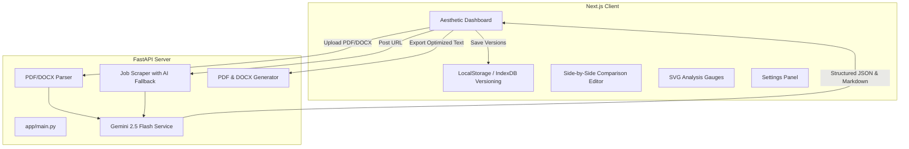

# ResumeAI - SaaS Resume Optimizer & Analysis Dashboard

ResumeAI is an AI-powered SaaS MVP application designed to analyze, score, match, and optimize resumes to fit target job descriptions. The application features a stateless processing engine combined with browser-based version management, offering a seamless and private experience.

## System Architecture

The project is split into a **Next.js & Tailwind CSS Frontend** (handling presentation, SVG charting, side-by-side comparison, and local version persistence) and a **FastAPI Backend** (handling PDF/DOCX parsing, job description scraping with AI fallback, Gemini AI match optimization, and PDF/DOCX compiler services).



---

## Features

- **Modern Responsive UI**: Professional glassmorphism card layouts, light/dark mode support, and smooth transitions.
- **Job Description Scraper**: Platform detection for Greenhouse, Lever, Ashby, SmartRecruiters, Workday, Oracle Careers, and SAP SuccessFactors, with an automated AI fallback parser.
- **Secure File Parser**: Support for PDF and DOCX file formats with size limit controls and magic number header checks.
- **ATS Analysis scorecard**: Estimations for ATS suitability score, match percentage, skill gaps, recommended keyword injection, experience and education alignment.
- **Draft Comparison**: A split-screen comparison layout showing original text and optimized markdown alongside a detailed list of changes.
- **Application Collateral Generator**: Generate customized Cover Letters, Recruiter outreach emails, LinkedIn headlines, and LinkedIn About summaries with an interview preparation questions drawer.
- **Style Settings**: Adjust spacing density, font families, and color brand accents on the generated PDF.
- **Double Export Engines**: Compile optimized resumes to ReportLab PDF or docx binary files.
- **Local Version Control**: Save, rename, load, and delete optimization runs locally in the browser's storage.

---

## Installation & Setup

### Prerequisites
- Node.js (v18+)
- Python (v3.10+)
- Gemini API Key (from [Google AI Studio](https://aistudio.google.com/))

### 1. Backend Setup

1. Navigate to the backend directory:
   ```bash
   cd backend
   ```
2. Create and activate a Python virtual environment:
   ```bash
   python -m venv venv
   # On Windows:
   venv\Scripts\activate
   # On macOS/Linux:
   source venv/bin/activate
   ```
3. Install dependencies:
   ```bash
   pip install -r requirements.txt
   ```
4. Create a `.env` file from the example:
   ```bash
   cp .env.example .env
   ```
   Add your Google Gemini API Key:
   ```env
   GEMINI_API_KEY=your_actual_api_key_here
   ```
5. Start the backend development server:
   ```bash
   uvicorn app.main:app --reload --port 8000
   ```
   The backend API docs will be available at: [http://127.0.0.1:8000/docs](http://127.0.0.1:8000/docs)

### 2. Frontend Setup

1. Navigate to the frontend directory:
   ```bash
   cd frontend
   ```
2. Install package dependencies:
   ```bash
   npm install
   ```
3. Start the Next.js development server:
   ```bash
   npm run dev
   ```
4. Open the application: [http://localhost:3000](http://localhost:3000)

---

## API Documentation

The backend exposes stateless endpoints prefixed with `/api`:

### `POST /api/scrape`
Extracts job descriptions from a listing URL.
*   **Request Body**: `{"url": "string"}`
*   **Response**:
    ```json
    {
      "platform": "Lever | Greenhouse | Workday...",
      "title": "Job Position",
      "company": "Company Name",
      "description": "Job description contents..."
    }
    ```

### `POST /api/parse`
Parses text content from a resume file.
*   **Request Format**: `multipart/form-data`
*   **Form Field**: `file` (PDF or DOCX document under 5MB)
*   **Response**: `{"text": "Extracted text content...", "filename": "resume.pdf"}`

### `POST /api/analyze`
Generates structured compatibility metrics between a resume and job description.
*   **Request Body**: `{"resume_text": "...", "job_description": "..."}`
*   **Response**: Structured JSON containing `ats_score`, `match_percentage`, `missing_skills`, `matching_skills`, `suggested_keywords`, etc.

### `POST /api/optimize`
Performs AI-powered resume content optimization.
*   **Request Body**: `{"resume_text": "...", "job_description": "...", "settings": {}}`
*   **Response**: `{"optimized_resume_markdown": "...", "changes": [{"section": "...", "description": "...", "original": "...", "optimized": "..."}]}`

### `POST /api/suggestions`
Generates application collateral (Cover Letter, Email, LinkedIn bios, interview questions).
*   **Request Body**: `{"resume_text": "...", "job_description": "..."}`
*   **Response**: Structured JSON containing customized cover letters, LinkedIn summaries,headlines, and interview Q&As.

### `POST /api/export`
Compiles optimized resume text into a binary document format (PDF or DOCX).
*   **Request Body**: `{"markdown_text": "...", "format": "pdf | docx", "settings": {}}`
*   **Response**: Binary document stream.

---

## Verification & Testing

To run backend tests, activate the venv, set PYTHONPATH, and execute:
```bash
$env:PYTHONPATH="app"
venv\Scripts\pytest
```
All parser checks and platform scrapers will be validated.
